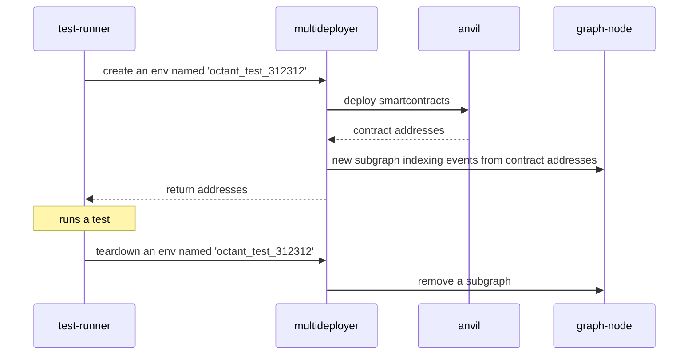

### Apitest architecture

API tests are performed in e2e way (but without the frontend, for this we have actual e2e tests). Components involved are:
* blockchain - a single anvil instance, starting from empty state, with a separate set of contracts deployed for each of the tests
* graph-node, indexing the blockchain, with a single subgraph per contract set
* python backend which is both an API-exposing service and a test runner
* multideployer, a primitive python HTTP service, that listens to HTTP requests from test runner, setting up and tearing down contracts+subgraph pairs.

Anvil, graph-node and multideployer are assumed to be up and running before test runner is launched. Multiple tests are executed using single instance of anvil and single instance of graph-node. In ideal world tests are independent of each other. In setup described above tests share anvil's block height. Since individual tests make assumptions about events over time, execution in parallel breaks tests. This is why tests are run sequentially. Please note that making parallel execution is possible, but it requires additional effort.

The sequence of setup, test execution and teardown is below.

Please note that subgraph is removed on test teardown because we've discovered that it reduces amount of crashes in graph-node. Anvil doesn't expose an easy way to delete contracts.
